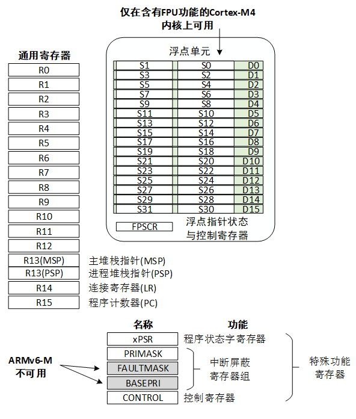
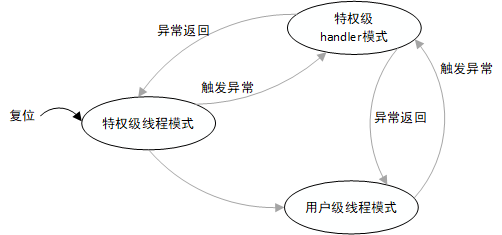
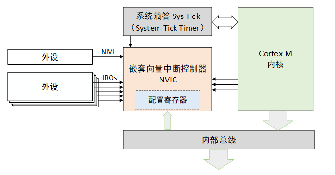
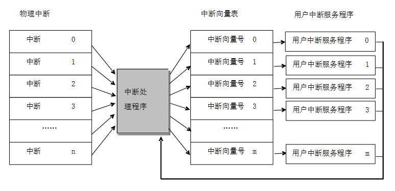
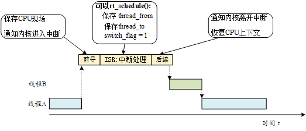
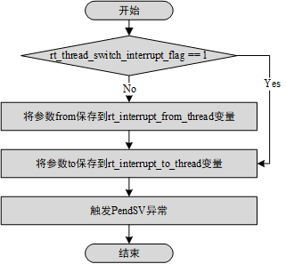

# 中断管理

## Cortex-M CPU 架构基础
Cortex-M 是一个家族系列，其中包括 Cortex M0/M3/M4/M7 多个不同型号，它们的编程模型基本是一致的



特殊功能寄存器包括程序状态字寄存器组（PSRs）、中断屏蔽寄存器组（PRIMASK, FAULTMASK, BASEPRI）、控制寄存器（CONTROL）

### 操作模式和特权级别
两种操作模式：线程模式，handler模式
两种特权级别：用户级，特权级


### NVIC


### PendSV 系统调用
PendSV 也称为可悬起的系统调用，它是一种异常，可以像普通的中断一样被挂起，它是专门用来辅助操作系统进行上下文切换的。 

最低优先级的异常。

## RT-Thread 中断工作机制


把一个函数（用户中断服务程序）同一个虚拟中断向量表中的中断向量联系在一起。当中断向量对应中断发生的时候，被挂接的用户中断服务程序就会被调用执行。

### 中断处理过程


#### 中断前导程序
1. 保存 CPU 中断现场，将上下文寄存器压入中断栈
2. 通知内核进入中断状态，调用 rt_interrupt_enter() 函数，作用是把全局变量 rt_interrupt_nest 加 1，从而记录中断层数

#### 用户中断服务程序
情况一：程序无需进行线程切换，完成后就退出中断。
情况二：中断处理过程中需要进行线程切换，调用rt_hw_context_switch_interrupt() 函数进行上下文切换


该函数处理流程：


#### 中断后续程序
1. 通知内核离开中断状态，通过调用 rt_interrupt_leave() 函数，将全局变量 rt_interrupt_nest 减 1
2. 恢复中断前的 CPU 上下文

### 中断嵌套
略

### 中断栈
和线程栈类似

### 中断的底半处理
将费时的底半操作交给线程来做


## RT-Thread 中断管理接口

接口和信号类似
```c
rt_isr_handler_t rt_hw_interrupt_install(int vector,
                                        rt_isr_handler_t  handler,
                                        void *param,
                                        char *name);
void rt_hw_interrupt_mask(int vector);
void rt_hw_interrupt_umask(int vector);

rt_base_t rt_hw_interrupt_disable(void);
void rt_hw_interrupt_enable(rt_base_t level);

void rt_interrupt_enter(void);
void rt_interrupt_leave(void);

//中断通知（通知内核）
void rt_interrupt_enter(void);
void rt_interrupt_leave(void);
//返回当前中断深度
rt_uint8_t rt_interrupt_get_nest(void);


```


