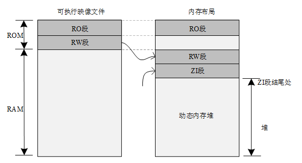
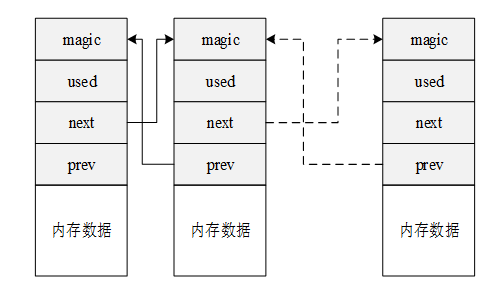
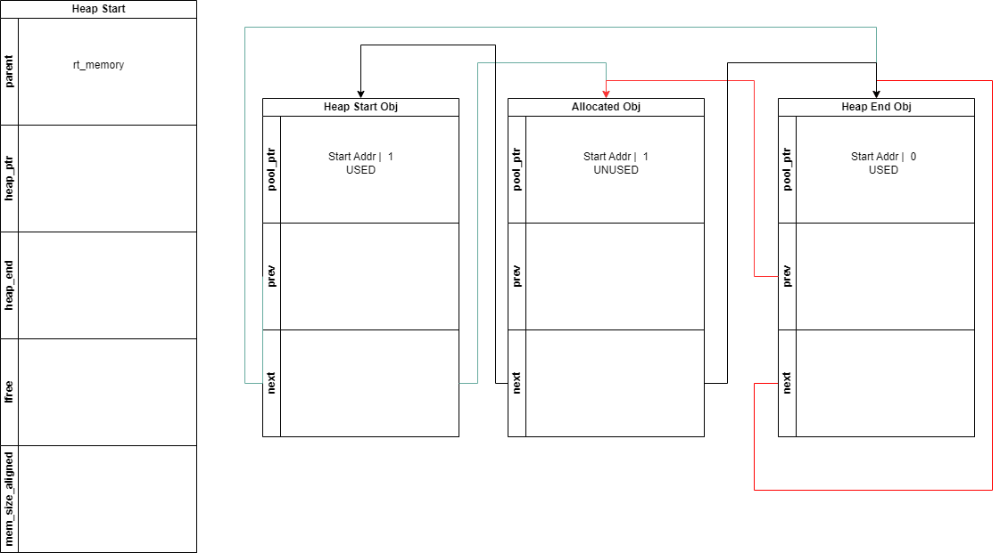
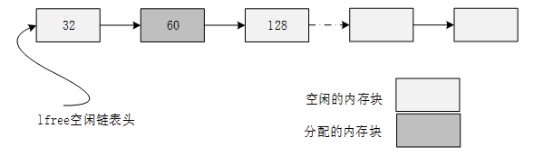
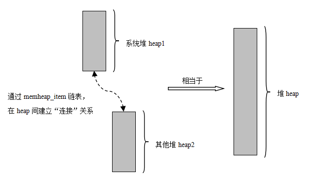
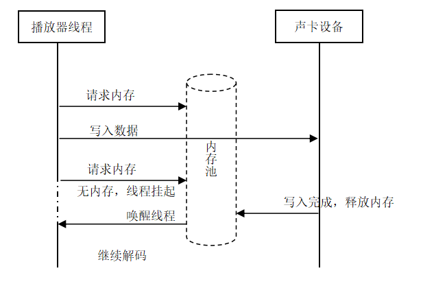
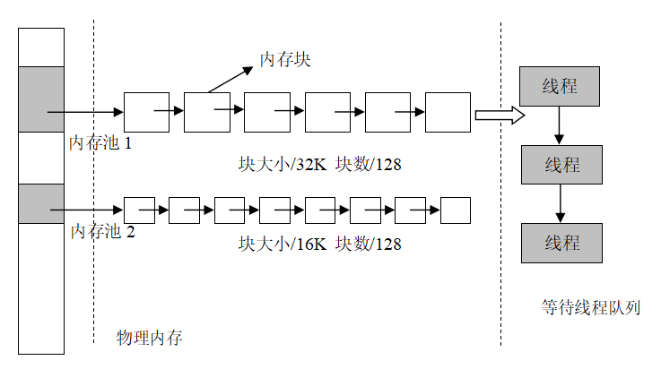
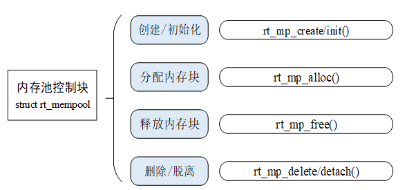

# 内存管理
## 内存管理的功能特点
- 分配内存的时间必须确定
- 必须解决内存碎片问题
- 内存资源紧张

## 内存堆管理
RT-Thread 将 “ZI 段结尾处” 到内存尾部的空间用作内存堆。用户申请的内存就从该堆中获取


### 内存管理算法
- #### 小内存管理算法 
初始时，它是一块大的内存。当需要分配内存块时，将从这个大的内存块上分割出相匹配的内存块，然后把分割出来的空闲内存块还回给堆管理系统中。
4.1.0之前的实现

4.1.0之后的实现


分配时案例：
12字节为头，剩下的给用户


- #### slab管理算法 
适用于大内存

- #### memheap管理算法 
适用于系统有多个地址不连续的堆
通过memheap_item粘合不同的堆


### 内存堆配置和初始化
```c
void rt_system_heap_init(void* begin_addr, void* end_addr);
rt_err_t rt_memheap_init(struct rt_memheap  *memheap,
                        const char  *name,
                        void        *start_addr,
                        rt_uint32_t size)
```
### 内存堆的管理方式


```c
void *rt_malloc(rt_size_t nbytes);
void *rt_realloc(void *rmem, rt_size_t newsize);
void *rt_calloc(rt_size_t count, rt_size_t size);

void rt_free (void *ptr);

//内存分配钩子函数，内存分配完成后进行回调。
void rt_malloc_sethook(void (*hook)(void *ptr, rt_size_t size));
//释放后回调
void rt_free_sethook(void (*hook)(void *ptr));

```

### 动态内存使用总结
动态内存使用要注意：
- 检查从 rt_malloc 函数返回的指针是否为 NULL
- 不要访问动态分配内存之外的内存
- 不要向 rt_free 传递一个并非由 rt_malloc 函数返回的指针
- 在释放动态内存之后不要再访问它
- 使用 sizeof 计算数据类型的长度，提高程序的可移植性

常见错误：
- 对 NULL 指针进行解引用
- 对分配的内存进行操作时越过边界
- 释放并非动态分配的内存
- 释放一块动态分配的内存的一部分 (rt_free(ptr + 4))
- 动态内存被释放后继续使用


## 内存池
内存堆管理器的问题：
- 分配效率不高，在每次分配时，都要空闲内存块查找
- 容易产生内存碎片

**内存池可以完善上述问题**


### 内存池工作机制
```c
struct rt_mempool
{
    struct rt_object parent;

    void        *start_address;  /* 内存池数据区域开始地址 */
    rt_size_t     size;           /* 内存池数据区域大小 */

    rt_size_t     block_size;    /* 内存块大小  */
    rt_uint8_t    *block_list;   /* 内存块列表  */

    /* 内存池数据区域中能够容纳的最大内存块数  */
    rt_size_t     block_total_count;
    /* 内存池中空闲的内存块数  */
    rt_size_t     block_free_count;
    /* 因为内存块不可用而挂起的线程列表 */
    rt_list_t     suspend_thread;
    /* 因为内存块不可用而挂起的线程数 */
    rt_size_t     suspend_thread_count;
};
typedef struct rt_mempool* rt_mp_t;

```

内存池在创建时先向系统申请一大块内存，然后分成同样大小的多个小内存块，小内存块直接通过链表连接起来（此链表也称为空闲链表）。每次分配的时候，从空闲链表中取出链头上第一个内存块，提供给申请者。

如图可以看出，内存块中还要额外存储next指针

### 内存池的管理方式


```c
rt_mp_t rt_mp_create(const char* name,
                         rt_size_t block_count,
                         rt_size_t block_size);
rt_err_t rt_mp_delete(rt_mp_t mp);

rt_err_t rt_mp_init(rt_mp_t mp,
                        const char* name,
                        void *start, rt_size_t size,
                        rt_size_t block_size);
rt_err_t rt_mp_detach(rt_mp_t mp);

void *rt_mp_alloc (rt_mp_t mp, rt_int32_t time);
void rt_mp_free (void *block);

```


