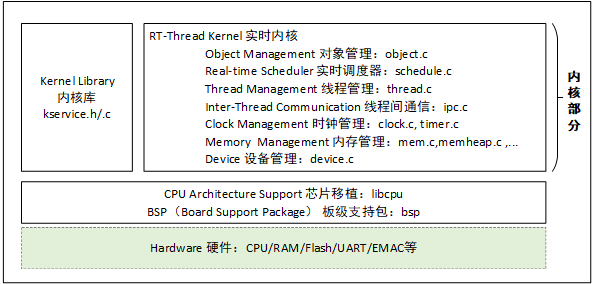
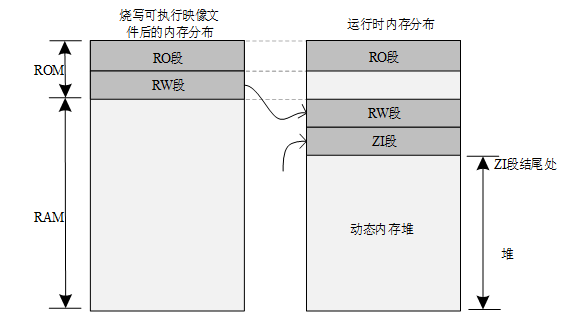
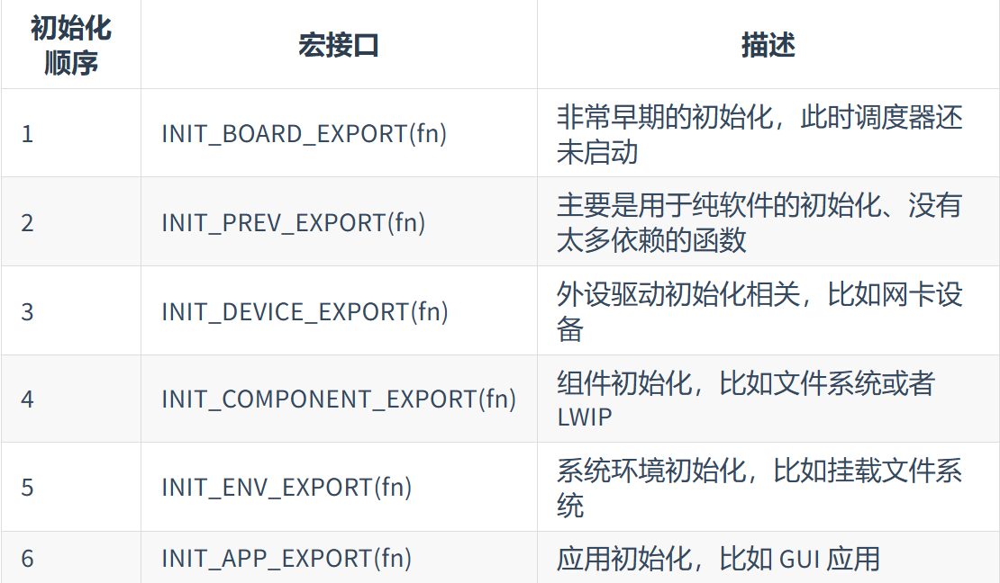
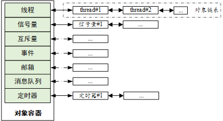

# 内核基础

## RT-Thread内核介绍

职责：管理线程，线程间通信，系统时钟，中断和内存等。

内核最小的资源占用情况是 3KB ROM，1.2KB RAM。



### 线程调度
调度算法：基于优先级的全抢占式多线程调度算法
不可抢占的代码段：中断处理函数，调度器上锁部分代码（？），禁止中断的代码（原语）

### 时钟管理
最小单位:时钟节拍
两种定时器：单次触发定时器，周期触发定时器
两种模式:HARD_TIMER,SOFT_TIMER

### 线程间同步
实现方法：信号量，互斥量，事件集
解决问题：，优先级翻转问题，支持线程等待多个事件

### 线程间通信
实现方法：邮箱，消息队列

### 内存管理
实现方法：静态内存池管理，动态内存堆管理

### IO设备管理
实现方法：按名称访问的设备管理子系统

### 启动流程
在MDK环境下，利用$Sub$$ 以及

$Super$$完成在main之前的系统启动


### 内存分布
1. RO段包括Code和程序中定义的常量,表示程序占的Flash空间大小
2. RW段包括初始化的全局变量（运行时占用RAM）
3. ZI段包括未初始化的全局变量（运行时才占用RAM）
4. 动态内存堆中存储申请和释放的内存块


### 自动初始化机制
**自动初始化机制是指初始化函数不需要被显式调用，只需要在函数定义处通过宏定义的方式进行申明，就会在系统启动过程中被执行。**

详见启动流程中的rt_components_board_init() 与 rt_components_init()

其中的蓝色部分就是各种提前通过申明的初始化函数



### 内核对象模型
#### 静态/动态对象
**静态**：通常在RW段或ZI段，在系统启动后就自动初始化。

**动态**：在空闲内存堆中创建，手工初始化

静态对象会占用 RAM 空间，但不依赖于内存堆管理器。动态对象则依赖于内存堆管理器，运行时申请 RAM 空间，被删除后，占用的 RAM 空间被释放。

#### 内核对象管理架构

RT-Thread 采用内核对象管理系统来访问 / 管理所有内核对象



采用继承的特性，简化系统的设计复杂度，提高可重用性和拓展性


对象容器
```c
struct rt_object_information
{
     /* 对象类型 */
     enum rt_object_class_type type;
     /* 对象链表 */
     rt_list_t object_list;
     /* 对象大小 */
     rt_size_t object_size;
};

```

对象控制块
```c
struct rt_object
{
     /* 内核对象名称     */
     char      name[RT_NAME_MAX];
     /* 内核对象类型     */
     rt_uint8_t  type;
     /* 内核对象的参数   */
     rt_uint8_t  flag;
     /* 内核对象管理链表 */
     rt_list_t   list;
};

//支持的类型
enum rt_object_class_type
{
    ///......///
};


```

### 内核配置实例

通过修改rtconfig.h中的宏定义来实现

### 常见的宏定义
```c
//rt_inline，定义如下，static 关键字的作用是令函数只能在当前的文件中使用；inline 表示内联，用 static 修饰后在调用函数时会建议编译器进行内联展开。
#define rt_inline                   static __inline

//RT_USED，定义如下，该宏的作用是向编译器说明这段代码有用，即使函数中没有调用也要保留编译。例如 RT-Thread 自动初始化功能使用了自定义的段，使用 RT_USED 会将自定义的代码段保留。
#define RT_USED                     __attribute__((used))

//RT_UNUSED，定义如下，表示函数或变量可能不使用，这个属性可以避免编译器产生警告信息。
#define RT_UNUSED                   ((void)x)

//RT_WEAK，定义如下，常用于定义函数，编译器在链接函数时会优先链接没有该关键字前缀的函数，如果找不到则再链接由 weak 修饰的函数。
#define RT_WEAK                     __weak

//ALIGN(n)，定义如下，作用是在给某对象分配地址空间时，将其存放的地址按照 n 字节对齐，这里 n 可取 2 的幂次方。字节对齐的作用不仅是便于 CPU 快速访问，同时合理的利用字节对齐可以有效地节省存储空间。
#define ALIGN(n)                    __attribute__((aligned(n)))

//RT_ALIGN(size,align)，定义如下，作用是将 size 提升为 align 定义的整数的倍数，例如，RT_ALIGN(13,4) 将返回 16。

#define RT_ALIGN(size, align)      (((size) + (align) - 1) & ~((align) - 1))

```
