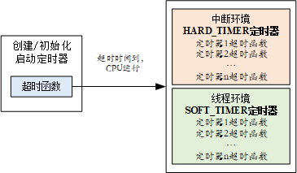
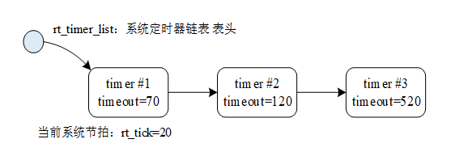
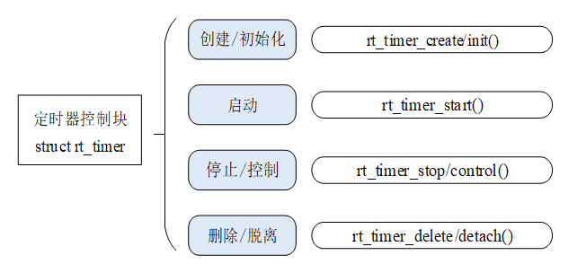

# 时钟管理

## 时钟节拍
时钟节拍的长度根据RT_TICK_PER_SECOND的定义来调整
OS Tick=1/RT_TICK_PER_SECOND

## 时钟节拍的实现
时钟节拍由配置为中断触发模式的硬件定时器产生，当中断到来时，将调用一次：void rt_tick_increase(void)

```c
//该函数会增加系统时间，检查当前进程时间片是否耗尽以及检查是否有其他硬件定时器超时
void rt_tick_increase(void)
{
    struct rt_thread *thread;

    /* 全局变量 rt_tick 自加 */
    ++ rt_tick;

    /* 检查时间片 */
    thread = rt_thread_self();

    -- thread->remaining_tick;
    if (thread->remaining_tick == 0)
    {
        /* 重新赋初值 */
        thread->remaining_tick = thread->init_tick;

        /* 线程挂起 */
        rt_thread_yield();
    }

    /* 检查定时器是否超时 */
    rt_timer_check();
}
```

## 获取时钟节拍
rt_tick_t rt_tick_get(void);

## 定时器管理
RT_Thread提供软件定时器，定时数值为OS Tick的整数倍。

两种类别：
- 单次触发定时器：只会触发一次定时器事件
- 周期触发定时器：会周期性的触发定时器事件，直到用户手动的停止


两种模式：

- HARD_TIMER(默认)：在中断上下文环境中运行，和正常定时器中断函数约束相似
- SOFT_TIMER:创建一个timer线程，在该线程的上下文运行

## 定时器工作机制

两个全局变量：
- rt_tick:系统时间
- rt_timer_list:定时器链表（按时间插入排序）



## 定时器控制块
```c
struct rt_timer
{
    struct rt_object parent;
    rt_list_t row[RT_TIMER_SKIP_LIST_LEVEL];  /* 定时器链表节点 */

    void (*timeout_func)(void *parameter);    /* 定时器超时调用的函数 */
    void      *parameter;                         /* 超时函数的参数 */
    rt_tick_t init_tick;                         /* 定时器初始超时节拍数 */
    rt_tick_t timeout_tick;                     /* 定时器实际超时时的节拍数 */
};
typedef struct rt_timer *rt_timer_t;

```

## 定时器跳表算法
目的:基于有序的链表，加快搜索链表元素的速度
通过增加索引实现"空间换时间"

## 定时器的管理方法

```c
//初始化定时器管理系统
void rt_system_timer_init(void);
void rt_system_timer_thread_init(void);//SOFT_TIMER
```


```c
//创建定时器
rt_timer_t rt_timer_create(const char* name,
                           void (*timeout)(void* parameter),
                           void* parameter,
                           rt_tick_t time,
                           rt_uint8_t flag);
//删除定时器
rt_err_t rt_timer_delete(rt_timer_t timer);

//初始化定时器（静态）
void rt_timer_init(rt_timer_t timer,
                   const char* name,
                   void (*timeout)(void* parameter),
                   void* parameter,
                   rt_tick_t time, rt_uint8_t flag);
//脱离定时器（不释放资源）
rt_err_t rt_timer_detach(rt_timer_t timer);

//启动/停止
rt_err_t rt_timer_start(rt_timer_t timer);
rt_err_t rt_timer_stop(rt_timer_t timer);

//控制定时器
rt_err_t rt_timer_control(rt_timer_t timer, rt_uint8_t cmd, void* arg);

```


