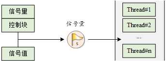
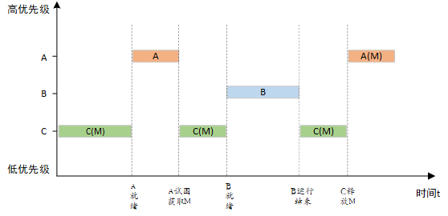
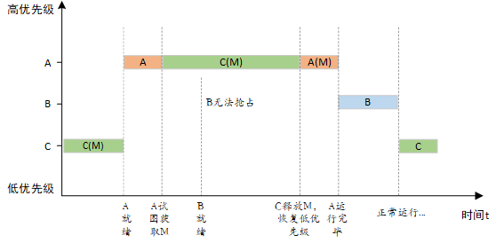
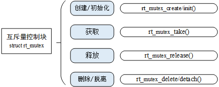

# 线程同步

核心：在访问临界区的时候只允许一个 (或一类) 线程运行。

## 信号量
信号量对象都有一个信号量值和一个线程等待队列

信号量的值对应了信号量对象的实例数目、资源数目，假如信号量值为 5，则表示共有 5 个信号量实例（资源）可以被使用，当信号量实例数目为零时，再申请该信号量的线程就会被挂起在该信号量的等待队列上，等待可用的信号量实例（资源）。

```c
//信号量控制块
struct rt_semaphore
{
   struct rt_ipc_object parent;  /* 继承自 ipc_object 类 */
   rt_uint16_t value;            /* 信号量的值 */
};
/* rt_sem_t 是指向 semaphore 结构体的指针类型 */
typedef struct rt_semaphore* rt_sem_t;
```

### 信号量管理方式
```c
//创建和删除信号量
rt_sem_t rt_sem_create(const char *name,
                    rt_uint32_t value,
                    rt_uint8_t flag);
rt_err_t rt_sem_delete(rt_sem_t sem);

//初始化和脱离信号量
rt_err_t rt_sem_init(rt_sem_t       sem,
                    const char     *name,
                    rt_uint32_t    value,
                    rt_uint8_t     flag)
rt_err_t rt_sem_detach(rt_sem_t sem);

rt_err_t rt_sem_take (rt_sem_t sem, rt_int32_t time);
rt_err_t rt_sem_trytake(rt_sem_t sem);//非阻塞

rt_err_t rt_sem_release(rt_sem_t sem);
```

重要问题模型：生产者消费者，读者写者

### 信号量的使用场合
- 线程同步
- 锁(了解即可，被互斥量取代)
- 中断与线程同步
- 资源计数（适合于线程间工作处理速度不匹配的场合）

## 互斥量
性质：是一种特殊的二值信号量
特点：互斥量支持递归访问且能防止线程优先级翻转；互斥量只能由**持有线程释放**，而信号量则可以由**任何线程释放**。

解决优先级翻转问题：

通过优先级继承协议解决:提高某个占有某种资源的低优先级线程的优先级，使之与所有等待该资源的线程中优先级最高的那个线程的优先级相等，然后执行


```c
struct rt_mutex
    {
        struct rt_ipc_object parent;                /* 继承自 ipc_object 类 */

        rt_uint16_t          value;                   /* 互斥量的值 */
        rt_uint8_t           original_priority;     /* 持有线程的原始优先级 */
        rt_uint8_t           hold;                     /* 持有线程的持有次数   */
        struct rt_thread    *owner;                 /* 当前拥有互斥量的线程 */
    };
    /* rt_mutext_t 为指向互斥量结构体的指针类型  */
    typedef struct rt_mutex* rt_mutex_t;

```

### 互斥量的管理操作


```c
//创建和删除
rt_mutex_t rt_mutex_create (const char* name, rt_uint8_t flag);//flag参数已作废
rt_err_t rt_mutex_delete (rt_mutex_t mutex);

rt_err_t rt_mutex_init (rt_mutex_t mutex, const char* name, rt_uint8_t flag);
rt_err_t rt_mutex_detach (rt_mutex_t mutex);

rt_err_t rt_mutex_take (rt_mutex_t mutex, rt_int32_t time);
rt_err_t rt_mutex_trytake(rt_mutex_t mutex);

rt_err_t rt_mutex_release(rt_mutex_t mutex);

```

### 互斥量的使用场合
- 线程多次持有互斥量的情况下。这样可以避免同一线程多次递归持有而造成死锁的问题。
- 可能会由于多线程同步而造成优先级翻转的情况。


## 事件集
目的：完成一对多，多对多的线程间同步
通过32位的位图完成事件组合

### 事件集的特点
- 事件只与线程相关，事件间相互独立
- 事件仅用于同步，不提供数据传输功能
- 事件无排队性

每个线程都有一个事件信息标记，分别是 逻辑与，逻辑或以及 清除标记，通过32个事件标记和这个信息标记判断是否满足同步条件

```c
struct rt_event
{
    struct rt_ipc_object parent;    /* 继承自 ipc_object 类 */

    /* 事件集合，每一 bit 表示 1 个事件，bit 位的值可以标记某事件是否发生 */
    rt_uint32_t set;
};
/* rt_event_t 是指向事件结构体的指针类型  */
typedef struct rt_event* rt_event_t;
```

### 事件集的管理方式


```c
//创建和删除
rt_event_t rt_event_create(const char* name, rt_uint8_t flag);
rt_err_t rt_event_delete(rt_event_t event);

//初始化和脱离
rt_err_t rt_event_init(rt_event_t event, const char* name, rt_uint8_t flag);
rt_err_t rt_event_detach(rt_event_t event);


rt_err_t rt_event_send(rt_event_t event, rt_uint32_t set);
rt_err_t rt_event_recv(rt_event_t event,
                           rt_uint32_t set,
                           rt_uint8_t option,
                           rt_int32_t timeout,
                           rt_uint32_t* recved);
```

### 事件集的使用场合
一定程度上代替信号量

与信号量的区别在于：
- 事件的发送操作在事件未清除前，是不可累计的
- 可同时等待多个事件


