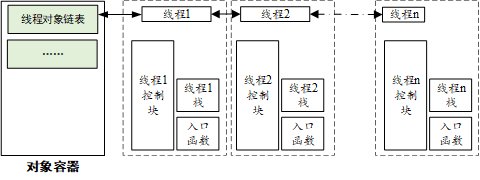
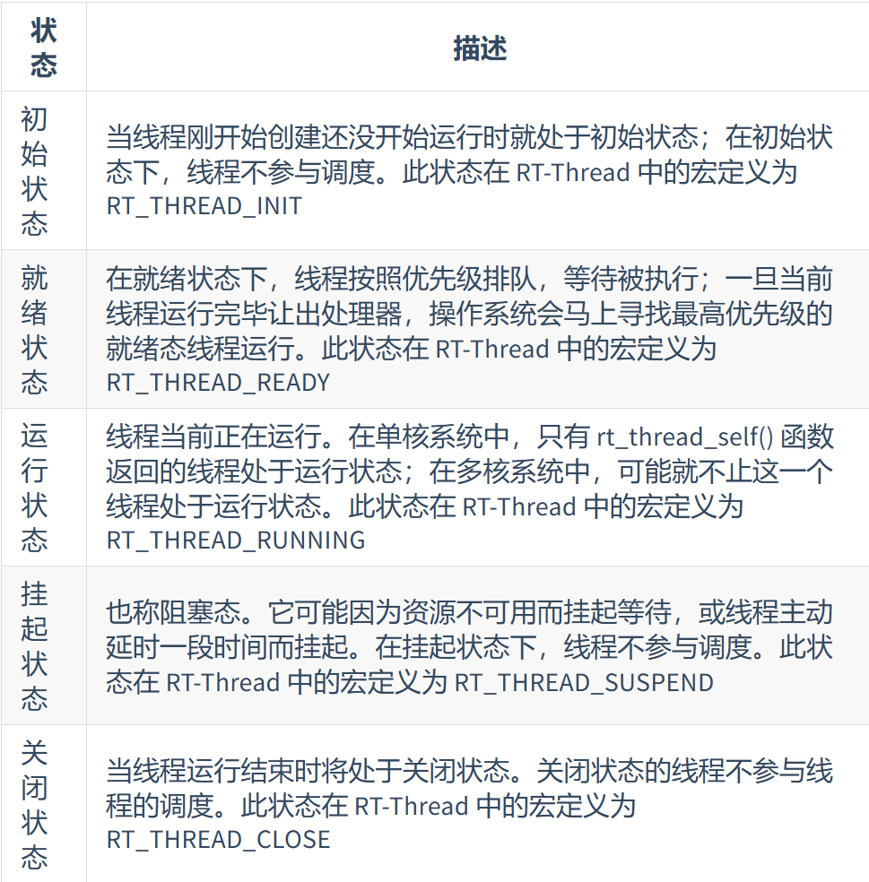
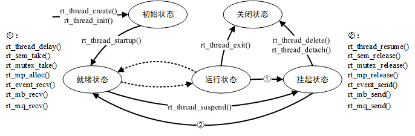
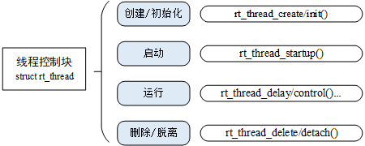

# 线程管理

## 线程管理的功能特点

- **两类线程：**
- 系统线程：内核创建的线程
- 用户线程：应用程序创建的线程




### 线程调度器
主要工作：在就绪线程列表中找到最高优先级线程并使其运行
调度器调度线程切换时，先将当前线程上下文保存起来，当再切回到这个线程时，线程调度器将该线程的上下文信息恢复。（上下文信息包括变量，寄存器值，堆栈，内存信息等）


## 线程的工作机制

线程控制块：存放线程的信息
线程栈：线程自己独立的栈，存放着线程的上下文

线程状态：


```
线程通过调用函数 rt_thread_create/init() 进入到初始状态（RT_THREAD_INIT）；初始状态的线程通过调用函数 rt_thread_startup() 进入到就绪状态（RT_THREAD_READY）；就绪状态的线程被调度器调度后进入运行状态（RT_THREAD_RUNNING）；当处于运行状态的线程调用 rt_thread_delay()，rt_sem_take()，rt_mutex_take()，rt_mb_recv() 等函数或者获取不到资源时，将进入到挂起状态（RT_THREAD_SUSPEND）；处于挂起状态的线程，如果等待超时依然未能获得资源或由于其他线程释放了资源，那么它将返回到就绪状态。挂起状态的线程，如果调用 rt_thread_delete/detach() 函数，将更改为关闭状态（RT_THREAD_CLOSE）；而运行状态的线程，如果运行结束，就会在线程的最后部分执行 rt_thread_exit() 函数，将状态更改为关闭状态。
```

线程优先级：优先级
时间片：对优先级相同的线程有效

### 系统线程

#### 空闲线程
##### 功能：
- 回收被删除线程的资源
- 提供接口运行用户设置的钩子函数

##### tips：
- 其他线程不允许一直死循环，必须有阻塞性质的函数，否则空闲线程无法执行线程删除，回收等操作

#### 主线程
入口函数为main_thread_entry;
执行main函数中的内容


## 线程的管理方式


**动态线程**是系统自动从动态内存堆上分配栈空间与线程句柄（初始化 heap 之后才能使用 create 创建动态线程）

**静态线程**是由用户分配栈空间与线程句柄，线程控制块、线程运行栈一般都设置为全局变量，在编译时就被确定、被分配处理。
```c
//创建动态线程/删除
rt_thread_t rt_thread_create(const char* name,
                            void (*entry)(void* parameter),
                            void* parameter,
                            rt_uint32_t stack_size,
                            rt_uint8_t priority,
                            rt_uint32_t tick);

rt_err_t rt_thread_delete(rt_thread_t thread);


//初始化静态线程/脱离
rt_err_t rt_thread_init(struct rt_thread* thread,
                        const char* name,
                        void (*entry)(void* parameter), void* parameter,
                        void* stack_start, rt_uint32_t stack_size,
                        rt_uint8_t priority, rt_uint32_t tick);

rt_err_t rt_thread_detach (rt_thread_t thread);

//启动线程
rt_err_t rt_thread_startup(rt_thread_t thread);

//获取当前线程
rt_thread_t rt_thread_self(void);

//.......//

```


