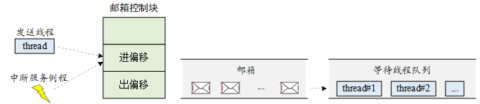
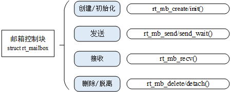
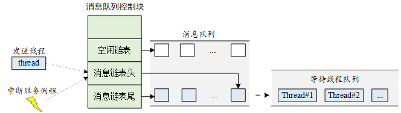
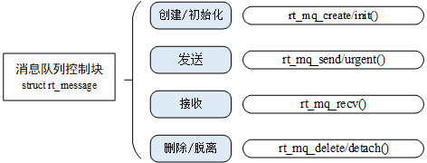
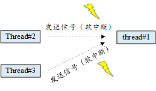
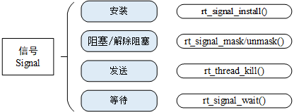

# 线程通信

## 邮箱
特点: 开销低，效率高，可用于中断，传输大小最大4字节（32位系统下的指针大小）


```c
struct rt_mailbox
{
    struct rt_ipc_object parent;

    rt_uint32_t* msg_pool;                /* 邮箱缓冲区的开始地址 */
    rt_uint16_t size;                     /* 邮箱缓冲区的大小     */

    rt_uint16_t entry;                    /* 邮箱中邮件的数目     */
    rt_uint16_t in_offset, out_offset;    /* 邮箱缓冲的进出指针   */
    rt_list_t suspend_sender_thread;      /* 发送线程的挂起等待队列 */
};
typedef struct rt_mailbox* rt_mailbox_t;

```
## 邮箱的管理方式


```c
rt_mailbox_t rt_mb_create (const char* name, rt_size_t size, rt_uint8_t flag);
rt_err_t rt_mb_delete (rt_mailbox_t mb);

rt_err_t rt_mb_init(rt_mailbox_t mb,
                const char* name,
                void* msgpool,
                rt_size_t size,
                rt_uint8_t flag)
rt_err_t rt_mb_detach(rt_mailbox_t mb);

//无等待，若满则立刻返回
rt_err_t rt_mb_send (rt_mailbox_t mb, rt_uint32_t value);
rt_err_t rt_mb_send_wait (rt_mailbox_t mb,
                      rt_uint32_t value,
                      rt_int32_t timeout);
//发送紧急邮件
rt_err_t rt_mb_urgent (rt_mailbox_t mb, rt_ubase_t value);
//接收邮件
rt_err_t rt_mb_recv (rt_mailbox_t mb, rt_uint32_t* value, rt_int32_t timeout);         
```

## 消息队列
特点：接收不固定长度的消息，FIFO


```c
struct rt_messagequeue
{
    struct rt_ipc_object parent;

    void* msg_pool;                     /* 指向存放消息的缓冲区的指针 */

    rt_uint16_t msg_size;               /* 每个消息的长度 */
    rt_uint16_t max_msgs;               /* 最大能够容纳的消息数 */

    rt_uint16_t entry;                  /* 队列中已有的消息数 */

    void* msg_queue_head;               /* 消息链表头 */
    void* msg_queue_tail;               /* 消息链表尾 */
    void* msg_queue_free;               /* 空闲消息链表 */

    rt_list_t suspend_sender_thread;    /* 发送线程的挂起等待队列 */
};
typedef struct rt_messagequeue* rt_mq_t;
```

### 消息队列的管理方式



```c
rt_mq_t rt_mq_create(const char* name, rt_size_t msg_size,
            rt_size_t max_msgs, rt_uint8_t flag);
rt_err_t rt_mq_delete(rt_mq_t mq);

rt_err_t rt_mq_init(rt_mq_t mq, const char* name,
                        void *msgpool, rt_size_t msg_size,
                        rt_size_t pool_size, rt_uint8_t flag);
rt_err_t rt_mq_detach(rt_mq_t mq);

rt_err_t rt_mq_send (rt_mq_t mq, void* buffer, rt_size_t size);
rt_err_t rt_mq_send_wait(rt_mq_t     mq,
                         const void *buffer,
                         rt_size_t   size,
                         rt_int32_t  timeout);
rt_err_t rt_mq_urgent(rt_mq_t mq, void* buffer, rt_size_t size);

rt_ssize_t rt_mq_recv (rt_mq_t mq, void* buffer,
                    rt_size_t size, rt_int32_t timeout);

```
###

### 消息队列的使用场合

- 同样可以发送指针来代替大量数据，而且直接发送局部结构体变量，可以避免手动释放内存资源
- 同步消息（消息队列+信号量/邮箱，前者发消息，后者ack）


## 信号
RT-Thread 中，将 sigset_t 定义成了 unsigned long 型，并命名为 rt_sigset_t  
能够使用的信号为SIGUSR1和SIGUSR2


### 信号的管理方式


```c
//安装信号（设置处理方式）
rt_sighandler_t rt_signal_install(int signo, rt_sighandler_t[] handler);

//屏蔽信号/解除屏蔽
void rt_signal_mask(int signo);
void rt_signal_unmask(int signo);

//发送
int rt_thread_kill(rt_thread_t tid, int sig);
//等待
int rt_signal_wait(const rt_sigset_t *set,
                        rt_siginfo_t[] *si, rt_int32_t timeout);

```
