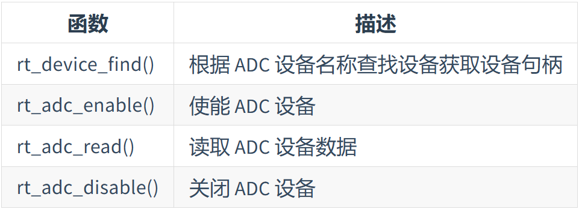

# ADC 设备

## 访问ADC设备



## 示例
```c
#define ADC_DEV_NAME        "adc1"  /* ADC 设备名称 */
#define ADC_DEV_CHANNEL     5       /* ADC 通道 */
rt_adc_device_t adc_dev;            /* ADC 设备句柄 */
rt_uint32_t value；
/* 查找设备 */
adc_dev = (rt_adc_device_t)rt_device_find(ADC_DEV_NAME);
/* 使能设备 */
rt_adc_enable(adc_dev, ADC_DEV_CHANNEL);
/* 读取采样值 */
value = rt_adc_read(adc_dev, ADC_DEV_CHANNEL);
/* 转换为对应电压值 */
vol = value * REFER_VOLTAGE / CONVERT_BITS;
rt_kprintf("the voltage is :%d.%02d \n", vol / 100, vol % 100);
/* 关闭通道 */
rt_adc_disable(adc_dev, ADC_DEV_CHANNEL);

```


