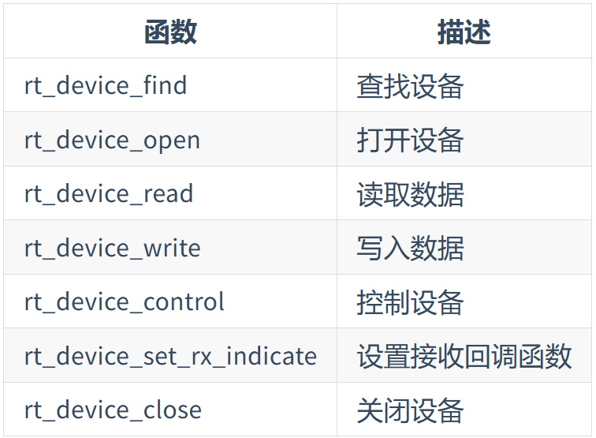

# CAN 设备

## CAN 简介

    特点：
        1. 可连接多个单元
        2. 多主控制：总线空闲时，所有单元都可发送信息
        3. 总线通过ID判定消息优先级，胜利的继续发送，失败的进行接收
        4. 要根据网络的规模设定合适的通信速度，所有单元需统一
    
    五种类型帧：
        数据帧：用于发送单元向接收单元传送数据的帧
        遥控帧：用于接收单元向具有相同 ID 的发送单元请求数据的帧
        错误帧：用于当检测出错误时向其它单元通知错误的帧
        过载帧：用于接收单元通知其尚未做好接收准备的帧
        帧间隔：用于将数据帧及遥控帧与前面的帧分离开来的帧

## 访问CAN设备

上层接口都一样
具体使用看手册
