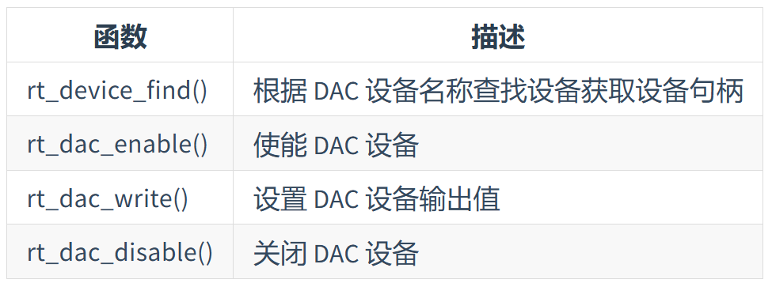

# DAC 设备

## 访问DAC设备



## 示例
```c
#define DAC_DEV_NAME        "dac1"  /* DAC 设备名称 */
#define DAC_DEV_CHANNEL     1       /* DAC 通道 */
rt_dac_device_t dac_dev;            /* DAC 设备句柄 */
rt_uint32_t value = 1000;          /* DAC 数据保持寄存器值 */
/* 查找设备 */
dac_dev = (rt_dac_device_t)rt_device_find(DAC_DEV_NAME);
/* 使能设备 */
rt_dac_enable(dac_dev, DAC_DEV_CHANNEL);
/* 设置输出值 */
rt_dac_write(dac_dev, DAC_DEV_CHANNEL， value);
/* 转换为对应电压值 */
vol = value * REFER_VOLTAGE / CONVERT_BITS;
rt_kprintf("the voltage is :%d.%02d \n", vol / 100, vol % 100);
/* 关闭通道 */
rt_dac_disable(dac_dev, DAC_DEV_CHANNEL);


```


