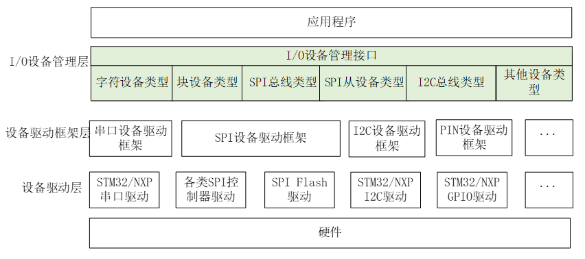
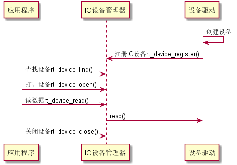
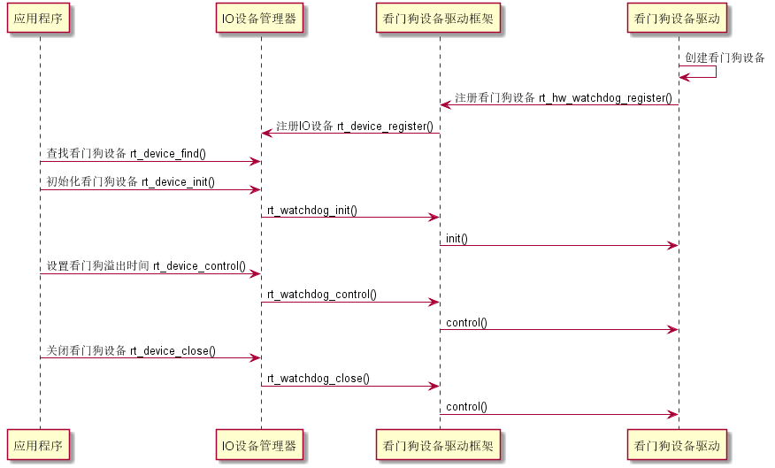
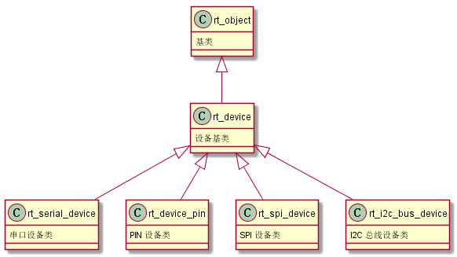
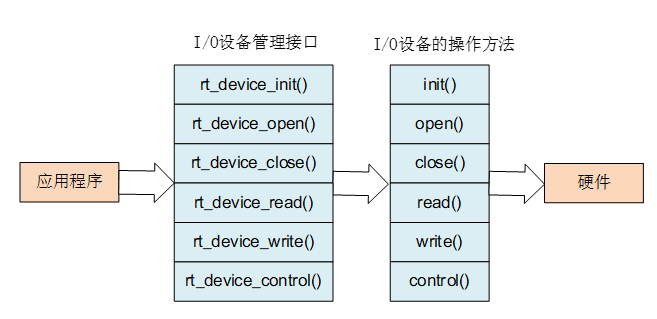

# IO设备模型

## IO设备介绍
RT-Thread提供了一套IO设备的框架


IO设备管理层：实现对标准设备驱动的封装。底层驱动变更不应影响该层接口的使用

设备驱动框架：对同类硬件设备驱动的抽象，不同的部分由下面驱动层完成

设备驱动层：实现对硬件设备的访问，也负责创建和注册IO设备



### IO设备模型

设备模型继承于基类，属于对象管理器范畴



```c
//具体定义
struct rt_device
{
    struct rt_object          parent;        /* 内核对象基类 */
    enum rt_device_class_type type;          /* 设备类型 */
    rt_uint16_t               flag;          /* 设备参数 */
    rt_uint16_t               open_flag;     /* 设备打开标志 */
    rt_uint8_t                ref_count;     /* 设备被引用次数 */
    rt_uint8_t                device_id;     /* 设备 ID,0 - 255 */

    /* 数据收发回调函数 */
    rt_err_t (*rx_indicate)(rt_device_t dev, rt_size_t size);
    rt_err_t (*tx_complete)(rt_device_t dev, void *buffer);

    const struct rt_device_ops *ops;    /* 设备操作方法 */

    /* 设备的私有数据 */
    void *user_data;
};
typedef struct rt_device *rt_device_t;

```

### IO设备类型
```c
RT_Device_Class_Char             /* 字符设备       */
RT_Device_Class_Block            /* 块设备         */
RT_Device_Class_NetIf            /* 网络接口设备    */
RT_Device_Class_MTD              /* 内存设备       */
RT_Device_Class_RTC              /* RTC 设备        */
RT_Device_Class_Sound            /* 声音设备        */
RT_Device_Class_Graphic          /* 图形设备        */
RT_Device_Class_I2CBUS           /* I2C 总线设备     */
RT_Device_Class_USBDevice        /* USB device 设备  */
RT_Device_Class_USBHost          /* USB host 设备   */
RT_Device_Class_SPIBUS           /* SPI 总线设备     */
RT_Device_Class_SPIDevice        /* SPI 设备        */
RT_Device_Class_SDIO             /* SDIO 设备       */
RT_Device_Class_Miscellaneous    /* 杂类设备        */
```

eg.

字符设备：每次传输一个字节

块设备：每次传输一个数据块，需要按照特定数据接口或者协议来传输

## 创建和注册IO设备

驱动层创建设备实例，并注册到设备管理器中

```c
rt_device_t rt_device_create(int type, int attach_size);

void rt_device_destroy(rt_device_t device);
```
创建后，需要完成该设备的操作方法
```c
struct rt_device_ops
{
    /* common device interface */
    rt_err_t  (*init)   (rt_device_t dev);
    rt_err_t  (*open)   (rt_device_t dev, rt_uint16_t oflag);
    rt_err_t  (*close)  (rt_device_t dev);
    rt_size_t (*read)   (rt_device_t dev, rt_off_t pos, void *buffer, rt_size_t size);
    rt_size_t (*write)  (rt_device_t dev, rt_off_t pos, const void *buffer, rt_size_t size);
    rt_err_t  (*control)(rt_device_t dev, int cmd, void *args);
};
```
完善后，需要注册到对应的设备管理器中

```c
rt_err_t rt_device_register(rt_device_t dev, const char* name, rt_uint8_t flags);


rt_err_t rt_device_unregister(rt_device_t dev);

```
## 访问IO设备


```c
//查找设备（获得句柄）
rt_device_t rt_device_find(const char* name);

rt_err_t rt_device_init(rt_device_t dev);

rt_err_t rt_device_open(rt_device_t dev, rt_uint16_t oflags);

rt_err_t rt_device_close(rt_device_t dev);

rt_err_t rt_device_control(rt_device_t dev, rt_uint8_t cmd, void* arg);

rt_size_t rt_device_read(rt_device_t dev, rt_off_t pos,void* buffer, rt_size_t size);

rt_size_t rt_device_write(rt_device_t dev, rt_off_t pos,const void* buffer, rt_size_t size);

//数据收发回调
rt_err_t rt_device_set_rx_indicate(rt_device_t dev, rt_err_t (*rx_ind)(rt_device_t dev,rt_size_t size));

rt_err_t rt_device_set_tx_complete(rt_device_t dev, rt_err_t (*tx_done)(rt_device_t dev,void *buffer));

```
## IO设备模型框架详细图


