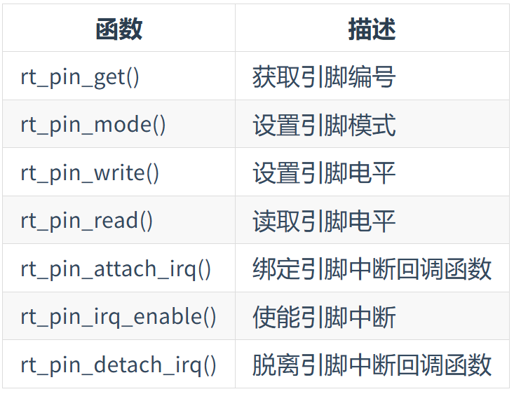

# PIN设备

## 访问 PIN 设备


## 获取引脚编号

```c
pin_number = rt_pin_get("PA.9");
```

## 设置引脚模式

```c
void rt_pin_mode(rt_base_t pin, rt_base_t mode);

#define PIN_MODE_OUTPUT 0x00            /* 输出 */
#define PIN_MODE_INPUT 0x01             /* 输入 */
#define PIN_MODE_INPUT_PULLUP 0x02      /* 上拉输入 */
#define PIN_MODE_INPUT_PULLDOWN 0x03    /* 下拉输入 */
#define PIN_MODE_OUTPUT_OD 0x04         /* 开漏输出 */

```

## 设置/读取电平
```c
void rt_pin_write(rt_base_t pin, rt_base_t value);
int rt_pin_read(rt_base_t pin);

```

## 绑定/使能引脚中断回调函数
```c
rt_err_t rt_pin_attach_irq(rt_int32_t pin, rt_uint32_t mode,
                           void (*hdr)(void *args), void *args);


#define PIN_IRQ_MODE_RISING 0x00         /* 上升沿触发 */
#define PIN_IRQ_MODE_FALLING 0x01        /* 下降沿触发 */
#define PIN_IRQ_MODE_RISING_FALLING 0x02 /* 边沿触发（上升沿和下降沿都触发）*/
#define PIN_IRQ_MODE_HIGH_LEVEL 0x03     /* 高电平触发 */
#define PIN_IRQ_MODE_LOW_LEVEL 0x04      /* 低电平触发 */


rt_err_t rt_pin_irq_enable(rt_base_t pin, rt_uint32_t enabled);

```


## 脱离引脚中断回调函数

```c
rt_err_t rt_pin_detach_irq(rt_int32_t pin);
```


